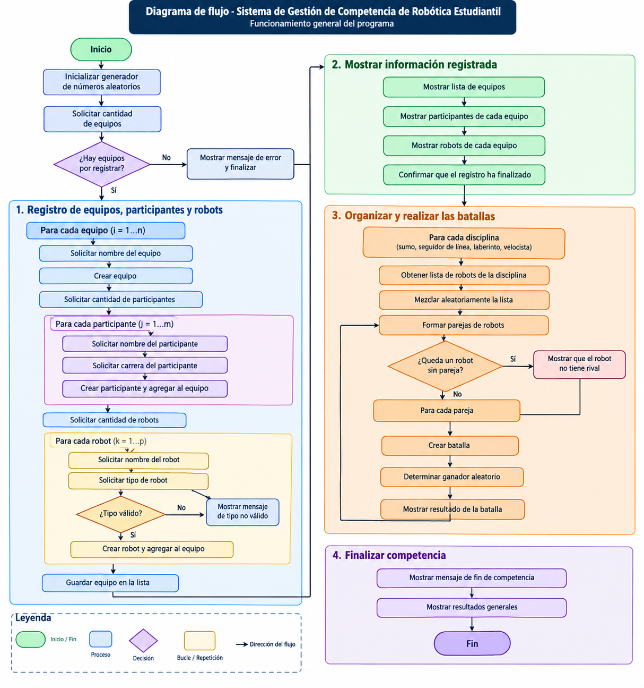

# Sistema de Gestión de Competencia de Robótica

## 1. Análisis y Diseño

### 1.1 Descripción del problema

El proyecto consiste en desarrollar un sistema de gestión para una competencia de robótica utilizando programación orientada a objetos en C++. El sistema deberá permitir registrar los equipos que participarán en la competencia, así como sus participantes y robots.

Cada participante deberá registrarse con su nombre y carrera, mientras que cada robot deberá registrarse con su nombre y disciplina. Las disciplinas consideradas a participar son sumo, seguidor de línea, laberinto y velocista.

Una vez terminado el registro, el sistema deberá organizar los robots de acuerdo con su disciplina y formar enfrentamientos aleatorios entre robots del mismo tipo. Para cada enfrentamiento se deberá determinar aleatoriamente un ganador.

Finalmente, el programa deberá mostrar la información de los equipos, participantes y robots registrados, así como los resultados de las batallas realizadas.
<br>
<br>

### 1.2 Requerimientos funcionales

| ID | Requerimiento |
|---|---|
| **RF-01** | Registrar la cantidad de equipos que participarán en la competencia. |
| **RF-02** | Registrar el nombre de cada equipo y sus participantes. |
| **RF-03** | Registrar el nombre y la carrera de cada participante. |
| **RF-04** | Registrar los robots pertenecientes a cada equipo, indicando su nombre y tipo de disciplina. |
| **RF-05** | Validar que el tipo de robot corresponda a una de las disciplinas permitidas: sumo, seguidor de línea, laberinto o velocista. |
| **RF-06** | Organizar los robots de acuerdo con su disciplina. |
| **RF-07** | Formar aleatoriamente parejas de robots que pertenezcan a la misma disciplina. |
| **RF-08** | Determinar aleatoriamente el ganador de cada batalla. |
| **RF-09** | Informar cuando un robot no tenga rival dentro de su disciplina. |
| **RF-10** | Mostrar la información de los equipos, participantes y robots registrados. |
| **RF-11** | Mostrar los resultados de las batallas realizadas. |
<br>


### 1.3 Entradas y salidas esperadas

| **Entrada** | **Salida esperada** |
|---|---|
| Cantidad de equipos | El programa solicita y registra la cantidad de equipos que participarán. |
| Nombre del equipo | El nombre del equipo queda registrado y se muestra posteriormente. |
| Cantidad de participantes | El programa solicita la cantidad de participantes que tendrá el equipo. |
| Nombre del participante | El nombre del participante se registra y se muestra dentro de la información del equipo. |
| Carrera del participante | La carrera se registra junto con los datos del participante. |
| Cantidad de robots | El programa solicita la cantidad de robots que tendrá el equipo. |
| Nombre del robot | El nombre del robot se registra y se muestra posteriormente. |
| Tipo de robot | El programa valida el tipo y registra el robot dentro de su disciplina correspondiente. |
| Robots de una misma disciplina | El programa forma parejas aleatorias para realizar las batallas. |
| Dos robots enfrentados | Se muestra el enfrentamiento y se determina aleatoriamente un ganador. |
| Robot sin rival | Se muestra un mensaje indicando que el robot no tiene rival. |
| Registro completo | Se muestran los equipos, participantes y robots registrados. |
| Resultados de la competencia | Se muestran las batallas realizadas y sus respectivos ganadores. |
<br>


### 1.4 Diagrama de flujo o pseudocódigo

```text
INICIO

Inicializar números aleatorios.

Solicitar cantidad de equipos.

PARA cada equipo:

    Solicitar nombre del equipo.
    Crear el equipo.

    Solicitar cantidad de participantes.

    PARA cada participante:

        Solicitar nombre.
        Solicitar carrera.
        Crear participante.
        Agregar participante al equipo.

    Solicitar cantidad de robots.

    PARA cada robot:

        Solicitar nombre.
        Solicitar tipo de robot.

        MIENTRAS el tipo no sea válido:

            Mostrar mensaje de tipo no válido.
            Solicitar nuevamente el tipo.

        Crear robot.
        Agregar robot al equipo.

    Guardar equipo.

Mostrar información de los equipos,
participantes y robots registrados.

PARA cada disciplina:

    Buscar los robots que pertenecen a esa disciplina.

    Mezclar aleatoriamente los robots.

    FORMAR parejas de robots.

    SI queda un robot sin pareja:

        Mostrar que el robot no tiene rival.

    SI NO:

        Crear una batalla entre los dos robots.
        Determinar aleatoriamente el ganador.
        Mostrar el resultado.

Mostrar que la competencia ha finalizado.

FIN
```


<br>


### 1.5 Casos de prueba anticipados

| **Caso** | **Escenario** | **Comportamiento esperado** |
|---|---|---|
| **1** | Un equipo con 2 robots del mismo tipo. | Los dos robots deben enfrentarse y debe mostrarse un ganador. |
| **2** | Varios equipos con participantes y robots registrados. | Todos los equipos, participantes y robots deben registrarse y mostrarse correctamente. |
| **3** | Un solo robot de una disciplina. | El programa debe indicar que el robot no tiene rival. |
| **4** | Tres robots del mismo tipo. | Debe realizarse una batalla y un robot debe quedar sin rival. |
| **5** | Cuatro robots del mismo tipo. | Deben realizarse dos batallas y ningún robot debe quedar sin rival. |
| **6** | Robots pertenecientes a diferentes disciplinas. | Solo deben enfrentarse robots que pertenezcan a la misma disciplina. |
| **7** | Ejecutar varias veces una competencia con los mismos robots. | Los emparejamientos y/o ganadores deben poder cambiar debido a la selección aleatoria. |

<br>
<br>

